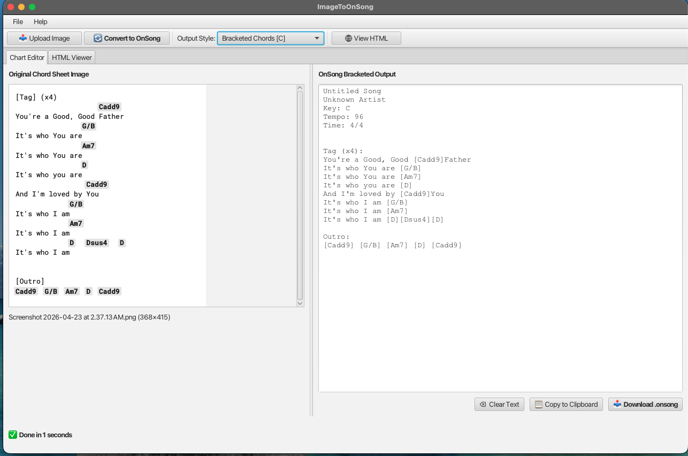
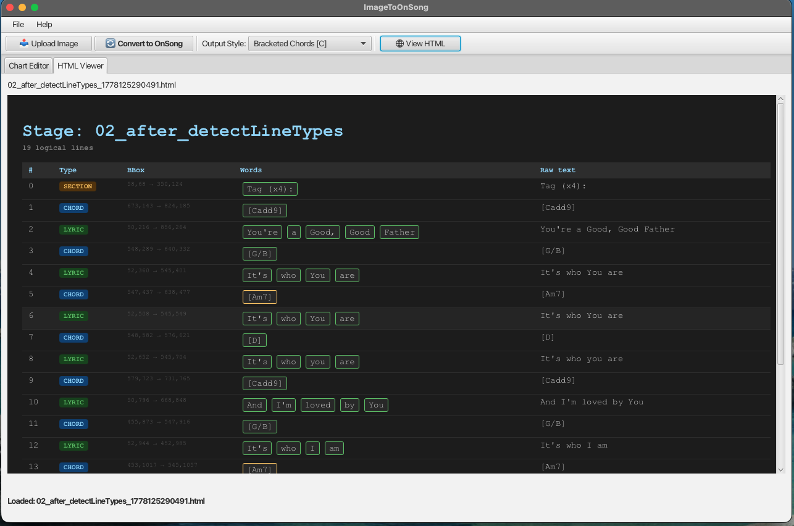

# ImageToOnSong

A Jpackaged Java App that runs on MacOS ARM (easy to rebuild for MacItell and likely Windows as well.

This App takes a screen shot of a chord chart and can OCR and filter to an OnSong style text file you can add to your library.
The main screen looks like 

The is also a built in HTML viewer that let's you see the quality and structure of the recognized content.

